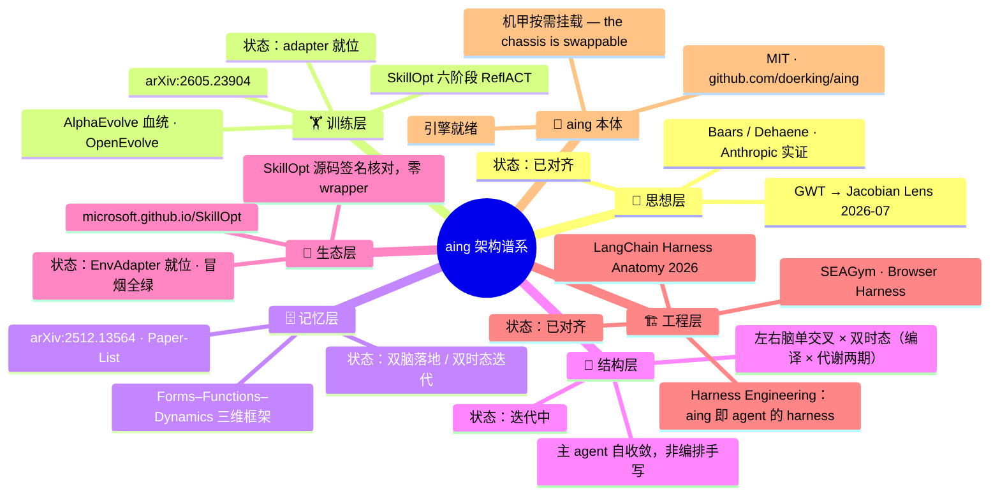

# aing · Knowledge Metabolism Engine

> Architecture for Intelligent Networked Growth — 定名：**交叉时态双脑 / Cross-Temporal Dual Brain**（交叉时态双脑：左右脑单交叉 × 双时态）
>
> 让知识库自己活着 —— 超越 RAG，超越 LLM Wiki，进入主动代谢时代。
>
> *aing is the engine: mature first, then mount into any chassis — the engine stays, the chassis is swappable.*
>
> aing 是引擎：先把自己磨成熟，机甲成熟哪家，就装进哪家——引擎不变，底盘随意。

**Let your knowledge base grow itself — beyond RAG, beyond LLM Wiki, into active metabolism.**

[](https://github.com/doerking/aing)
[](https://github.com/doerking/aing)

---

## 🔥 Shell-Agnostic · Verified

> aing binds to **no note-taking app**. Verified: **plain Markdown + Git + Node alone run the full metabolism loop.**
> Tolaria / Obsidian / SilverBullet / plain terminal — all are optional front-end shells. 有条件就把两脑实体软件（Tolaria + LLM Wiki）配置上，见下文「两脑实体软件」。

| Pillar | What it doesn't fuss over | Status |
|---|---|---|
| Shell-agnostic | Front-end / storage / runtime | ✅ |
| Consciousness Neural | Sensory → Guide Chain → Consciousness 3-layer | ✅ implemented — coordination-only kernel; metabolism→kernel events wired 2026-09-08 (`e847d15`)
| Metacognition | Self-check → Evaluate → Adjust 3-layer | ✅ implemented — advisory only; selfCheck reads real KESPI/errorRate (M4); reviewConsciousness wired to kernel; decision lineage logged (Phase 2.6 complete)
| Tri-Path Orchestrator | Explore / Verify / Optimize with circuit breaker | ✅ implemented — real scoring, no mock (docs realigned 2026-09-08)

**Zero LLM calls in the core loop: plain MD + Node runs the full metabolism; semantic vectors are local & optional. LLMs are optional host shells (session memory, compile aid) — not engine parts. / 核心代谢环零 LLM 调用：MD + Node 跑完全程，语义向量本地可选；LLM 是可选宿主外壳（会话记忆/编译辅助），不是引擎零件。**
> **Naming discipline / 措辞纪律**："Consciousness" 在本包中始终指**意识神经协调层**——9 通道事件感知 → 注意力路由 → 简报生成；coordination-only（不执行、不自动批准），写入一律走 `ingest → 代谢管线`。它不是自主意识体：无自主目标、无外部行动力。*"Consciousness" here always means the coordination-only neural layer (sense → route → brief); it is not an autonomous agent — no self-set goals, no external agency, writes only via the ingest pipeline.*


## 🗣️ Two Sentences / 两句话说清

**给普通用户 / For you:**

> 你只管写和说——链接它来连、分数它来打、过期它来剪。笔记会烂尾，aing 不会，因为它自己养自己。
>
> *You just write and talk. aing links, scores, prunes and feeds what you saved — notes rot; aing raises itself.*

**给 Agent / For your agent:**

> aing 为你准备好一切——资料、思维导链、备忘录，你出场就手持备忘录从容工作。你负责分析用户、给用户策划方向，其余的 aing 管。
>
> *aing prepares everything for you — materials, thinking chains, and a memo. You walk in holding the memo, calm and ready. You focus on analyzing the user and planning their direction; aing handles the rest.*

> **备忘录的意义 / Why the memo matters**：备忘录是 agent 的驾驶仪表台——它不是给用户看的文档，是 aing 给 agent 的"出场包"。每次会话开始，agent 先读 `GET /api/consciousness/briefing`，拿到三样东西：**aing 当前状态**（意识层 state / 通道健康 / 活跃事件）、**组件链接状态**（知识库在线？向量就绪？代谢上次跑完？蒸馏债多少？）、**待办与会话交接**（上次聊到哪、有什么挂起的 Todo）。读完备忘录，agent 不用问"知识库里有什么"——它已经知道了。备忘录让 agent 从"翻文件找线索"变成"手持仪表台做判断"。
>
> *The memo is the agent's dashboard — not a user-facing document, but aing's "walk-in package." Before each session, the agent reads the briefing and gets: aing's current state (consciousness kernel, channel health, active events), component link status (KB online? vectors ready? metabolism last run? distill debt?), and session handoff (where we left off, pending Todos). The memo turns the agent from "scavenging files for clues" into "reading a dashboard and making decisions."*

**诚实的边界 / The honest edge:**

> aing 不替你思考，也不替你上网找新知识——它只做一件事：让你和你的 agent 已经知道的一切，活得比你的记性和它的上下文窗口都长。
>
> *aing neither thinks for you nor fetches for you. It does one thing: makes everything you already know outlive both your memory and its context window.*

## 🫀 Two-Brain Bodies (Optional) / 两脑实体软件（可选）

> The release is the **plain-Markdown edition** — MD + Git + Node alone run the full metabolism loop. No extra software required.
> 底层渊源：aing 两脑的底层架构正是 **LLM Wiki + Tolaria** 这两款数据库软件——因当时原版装不上，作者以纯 Markdown + Node 把这一底层重写成了 MD 版（即本发布包）。
> 项目时间线：立项 **2026-06** ｜ MD 版底座成形 **2026-07** ｜ 仓库 **2026-08** 起陆续上线（最早归档 2026-08-29）。**鸣谢区分三类账，且明确反对混记**：① **软件蓝本**——`Tolaria` 与 `LLM Wiki` 类数据库软件，当年原版装不上，故以纯 Markdown + Node 把那一层能力重写成 MD 版（即本发布包）；② **真实使用的底座依赖**——SQLite/WASM、ONNX Runtime、Hugging Face 生态、Mermaid、Node + Git；③ **同构引证**——别人独立做出来、与本包思路相合的工作。三者都不是背书关系。**特别注意：aing 与 Karpathy 的 LLM Wiki 范式是相反路线**（那边是"摄入→编译→查询"的线性静止资产，这边给知识加上发芽/授粉/芥子/再生/过期的代谢），所以**只认它的社区工具作数据层蓝本，不认它作概念源头**（详见 `docs/User-Guide/03-FAQ.md` §10）。
> Timeline: founded **2026-06**; MD substrate shaped **2026-07**; on the public repo since **2026-08** (earliest archive 2026-08-29). **The credits split three ways and must not be conflated**: (1) **software blueprints** — Tolaria and LLM-Wiki-family database tools, re-implemented in plain Markdown + Node because the originals could not be installed then; (2) **foundational dependencies actually used** — SQLite/WASM, ONNX Runtime, the Hugging Face ecosystem, Mermaid, Node + Git; (3) **isomorphic citations** — independent convergence, not lineage. **Note: aing runs contrary to Karpathy's LLM Wiki paradigm** (compile once into a static asset, versus metabolism: sprout / pollinate / mustard-seed / regenerate / expire), so its community tools are credited as a data-layer blueprint only, never as a conceptual origin (see `docs/User-Guide/03-FAQ.md` §10).
> Origin note: aing's two-brain substrate re-implements two database tools — **LLM Wiki + Tolaria** — in plain Markdown, because the originals could not be installed at the time.
> 有条件的用户，可以把两脑各自的实体软件挂上，让秩序脑与生长脑各得其所：

| Brain | Entity Software / 实体软件 | What it adds / 补上什么 |
|---|---|---|
| Order Brain / 秩序脑 | LLM Wiki 范式的社区实现（数据库软件；概念源自 Karpathy 2026 年同名构想） | 摄入 → 编译 → 查询的成熟编译前端 |
| Growth Brain / 生长脑 | Tolaria（数据库软件） | 人读视图、双向链接浏览、每日笔记 |

> 两者均为可选外壳：aing 不绑定任何一款 —— 卸掉任何一个，代谢照跑。
> Both are optional shells: aing binds to neither — unplug either one and the metabolism keeps running.
>
> 📦 实装建议（数据流契约、运行节律、验收清单）：**[Two-Brain Bodies Setup / 两脑实体实装建议](./docs/Engineering/TWO-BRAIN-BODIES.md)**

---

## One Line / 一句话

aing is not a fork or modification of the LLM Wiki paradigm (Karpathy's 2026 concept and its community implementations, database-style tools) — it is an **upgrade from the "compilation paradigm" to the "metabolism paradigm."**

aing 不是对 LLM Wiki 范式（Karpathy 2026 年提出的概念及其社区实现，数据库类工具）的修改或分支，而是从"编译范式"到"代谢范式"的升级。

| | LLM Wiki（编译范式） | aing |
|---|---|---|
| Paradigm | Compilation / 编译 | **Metabolism / 代谢** |
| Growth | Linear: ingest→compile→query | Non-linear: sprout·pollinate·metabolize·regenerate |
| LLM role | Single LLM as "programmer" | None required in the core loop (mechanical steps + local models); optional host-agent shells
| Ceiling | ~200 sources / 50K tokens | 单库 50 标签类目健康 / 100 可用 / 150+ 退化（多库扩展，容量推演见 [TAG-CAPACITY-ANALYSIS](./docs/Engineering/TAG-CAPACITY-ANALYSIS.md)） |

## Architecture / 架构

```
┌──────────────────────────────────────────────────────────────┐
│                    aing · 架构                                │
├──────────────────────────┬───────────────────────────────────┤
│   Order Brain / 秩序脑   │   Growth Brain / 生长脑            │
│   (compile.js)           │   (sprout/pollinate/compress/prune)│
│ • MD + Git               │ • Sprouting / Pollination           │
│ • entities/links Graph   │ • Mustard Seed / Tissue Culture    │
│ • Type Classification    │ • KESPI Metabolism                 │
│ • YAML frontmatter       │ • Expiry Decay                    │
├──────────────────────────┴───────────────────────────────────┤
│ Consciousness Neural / 意识神经                               │
│ • Sensory Endings (file polling)                             │
│ • Neural Guide Chain (attention scoring)                     │
│ • Consciousness Layer (briefing generation)                  │
├──────────────────────────────────────────────────────────────┤
│ Metacognition / 元认知                                        │
│ • Self-check → Evaluate → Adjust                             │
├──────────────────────────────────────────────────────────────┤
│ Tri-Path Orchestrator / 三路突击                               │
│ • Explore / Verify / Optimize + Circuit Breaker              │
├──────────────────────────────────────────────────────────────┤
│ Assets: assets/skills/aing-operator + neural-evolution-swarm │
│          (bundled specs; packaged != installed in runtime)   │
│ Storage: fs-based (wiki/entities/*.md, wiki/links/*.md)      │
│          + sql.js (in-memory SQLite via knowledge-store.js)  │
│ Runtime: Node.js CommonJS (.js), no TypeScript, no build     │
└──────────────────────────────────────────────────────────────┘
```

---

## Quick Start / 快速开始


> **最短路径 / Fastest path**：`npm run bootstrap` —— 一键完成 依赖 → 配置 → 建库 → 代谢链 → 语义模型 → 验收，跑完即可查询。以下为分步说明。
```bash
# 1. Clone
git clone https://github.com/doerking/aing.git
cd aing

# 2. Install dependencies（核心：sql.js / transformers；sharp 可选，非核心管道所需）
npm install

# 3. Configure
cp growth.config.example.js src/growth.config.js
# edit src/growth.config.js → adjust KESPI thresholds and jiezi settings

# 4. Initialize database（种子知识源 raw/*.md 已随仓库分发，首次运行重建库）
node src/setup-db.js                 # verify / create if missing
node src/setup-db.js --reset         # reset to empty (auto-backup)

# 5. Add your knowledge (put .md files in raw/)
echo "# My First Knowledge

Content here...

[tag:example:5]
" > raw/my-first-doc.md

# 6. Run full metabolism pipeline (11 steps: compile→import→distill→link→link-sync→vector→sprout→pollinate→compress→kespi→prune) / 完整代谢（11 步）
node src/run-metabolism.js
# 代谢默认不替用户提交：compile 步的 git add -A + commit 已被 AING_NO_AUTOCOMMIT 关掉（确需时 AING_AUTOCOMMIT=1，门禁 C13 钉住）
# 7. Smart mode (GrowthDirector decides what to do)
node src/run-metabolism.js --smart

# 8. With feedback analysis (before/after comparison)
node src/run-metabolism.js --smart --feedback

# 9. View KESPI 8-dim scores
node src/show-kespi.js

# 10. Scan knowledge gaps
node src/gap-detector.js

# 11. Growth director (decision only)
node src/growth-director.js

# 12. Guide chain swarm (multi-agent deliberation)
node src/guide-chain-swarm.js
```

> **Note**: aing is a collection of standalone Node.js scripts (CommonJS `.js`), not a TypeScript project — each script is run directly with `node`. `package.json` only declares dependencies & shortcuts (`npm run verify` / `npm run all` / `npm run calibrate:fusion`).
>
> **Agent 必读：** 部署/验收/排障前先读 [`AGENTS.md`](./AGENTS.md)。部署完成后必跑 `node verify-deploy.js` —— 拿到 ALL GREEN 报告才算部署完成。

### Local Semantic Vectors (Optional) / 本地语义向量（可选）

> 发布包**已内置 384 维语义模型**（models\ 目录），装完依赖即是语义模式——本节仅在模型缺失/换机时需要。若只想用 64-dim 零依赖哈希向量，删除 `models\` 目录即可，全程约 10 分钟。

```bash
# 1. 一键安装（npm 依赖 + 模型下载，模型走 hf-mirror.com 国内镜像）
powershell -ExecutionPolicy Bypass -File setup-vectors.ps1

# 2. 重建索引为 384 维语义向量
node src/index-vectors.js --semantic --reindex
```

- 模型（all-MiniLM-L6-v2 量化版，约 22MB）落在 `models\` 目录，装完**纯离线**，零外呼。
- 国内网络**直连 huggingface.co 会超时**——脚本已默认走 hf-mirror 镜像，这是最常见的部署卡点，已替你排掉。
- 回退：删掉 `models\` 目录即自动回退纯哈希模式（或加 `--hash` 强制），两套向量在库里按维度自动区分、互不干扰。

---

## Try Demo Data (Optional) / 演示数据（可选，60 秒体验）

```bash
npm run seed:demo     # 灌入 6 篇虚构演示文档（云杉折纸社）：不碰真实数据、不产生 git 提交
npm run query -- "千纸鹤"       # 看融合分构成与链接命中
npm run unseed:demo   # 拆除：按 demo-% 前缀清 DB 六表 + 文件，真实数据零接触
```

演示组刻意设计：密集双向链接（KD 密度维）、created 时间梯度（KG 生长维）、
一组符号规范争议文档（KQ 一致性场景）。seed 后实体 14（仍 <30，标定工具按实况提示小样本纪律；实体 ≥30 后结论才够硬）。

## Resident Services & API (Optional) / 常驻服务与 API（可选）

```bash
# 常驻调度 / resident scheduler: metabolism every 30 min by default; new raw/ docs auto-trigger (polling, not fs.watch)
npm run scheduler            # env AING_SCHEDULER_INTERVAL_MS to tune interval / 环境变量可调间隔

# HTTP API (port 3789 by default)
npm run server               # without AING_API_KEY: listens on 127.0.0.1 (local-trust mode) / 未设密钥仅监听本机
AING_API_KEY=my-key npm run server   # with key: 0.0.0.0 + Bearer auth on all but /health / 设密钥后全端点认证

# 备忘录与入库 CLI / memo + ingest CLI（不起服务也能用，这就是“最后一米”那两条）
node src/memo.js --summary        # 仪表台：意识层 + 组件链接 + 告警 + 待办 + 健康判定 + 派单 / dashboard
node src/memo.js --peek           # 只读快拍（纯 JSON：health + todos + dispatch）/ machine-readable glance
node src/memo.js --dispatch       # 只问要不要派神经进化团队 / should we dispatch the swarm
node src/memo.js todo add "<用户挂着的事>" [--due YYYY-MM-DD] [--agent]   # 把待办记进备忘录（面板与仪表台同一张表）
node src/memo.js todo list        # 看活跃待办；--all 含已销（留痕不删行）
node src/memo.js todo done <id>    # 销办
node src/memo.js --actions        # 只要下一步命令 / derived next actions only
node src/auto-ingest.js <session-id> "<json|文本>"    # 一次性入库（投完退出；--keep 才转常驻批处理）

# 意识层写端 CLI / control surface（读靠 memo，动手靠 neural；二者都不必起服务）
node src/neural.js status           # 只读：kernel 状态 + 在效抑制清单 / read-only
node src/neural.js event '{"channel":"anomaly","target":"<目标>","intensity":0.9}'   # 投一条意识事件
node src/neural.js inhibit <目标> [--reason r] [--hours N]   # 抑制误报源（到期自动失效，kernel 无撤销 API）
node src/neural.js assess '[{"channel":"structure","target":"wiki/x.md"}]'          # 评估（走 controller → 同一个 kernel）
node src/neural.js verify '{"checks":[{"name":"复验全绿","passed":true}]}'          # 补记校验到 decision lineage
node src/neural.js record '{"result":"...","lesson":"..."}' # 补记结果与教训
node src/neural.js deliberate high  # 蜂群协商维护（只出共识不执行；需本院 knowledge.db）

# 查询 CLI / query CLI
node src/query.js "三路突击" --limit 5

# 端点一览 / endpoints
# ── 意识神经控制 + 备忘录（agent ↔ aing 主界面）──
# GET  /api/consciousness/briefing    memo / 备忘录（aing 状态 + 组件链接 + 告警热点 + 待办 + 会话交接）
# GET  /api/consciousness             意识神经状态（焦点/唤醒/通道健康）
# POST /api/consciousness/event      agent 向 kernel 投递意识事件
# POST /api/consciousness/sense      agent 感知（检索 + 记录谱系）
# POST /api/consciousness/assess     agent 评估（事件 → kernel 整合）
# GET  /api/consciousness/lineage    最近决策谱系
# ── 知识检索 ──
# GET  /health                       health check (public) / 健康检查（公开）
# GET  /api/status                    runtime status / 运行时状态
# GET  /api/entities                 entity list / 实体列表
# GET  /api/entity/<id>              entity detail + latest KESPI / 实体详情+最新 KESPI
# GET  /api/query?q=<词>&limit=<N>   full-chain search (answer-pack: snippet/kespi/neighbors/tags) / 全链检索
# ── 入库写入 ──
# POST /api/ingest                   session ingest (role: user/assistant/analysis/research) / 会话入库（四种角色；只入贴出来的详情，纯采集过程回 422）
# POST /api/entity                  create entity (Todo/Skill/Output) / 创建实体
# PATCH /api/entity/<id>            update entity status/content / 更新实体
# GET  /api/delta?since=<ISO>        incremental awareness / 增量感知
# GET  /api/tags/<tag>               tag-driven loading / 标签驱动加载
```

> **Tolaria 9 段标签容量**：`[tag:xxx:N]` N=1-9 关联强度。50 类目健康 / 100 可用 / 150 退化 / 200+ 走样。50 类目为 Tolaria + LLM.WIKI 数据库软件进入时机。推演数据见 [TAG-CAPACITY-ANALYSIS.md](./docs/Engineering/TAG-CAPACITY-ANALYSIS.md)。

---

## Current Iteration Notes (P0–P2 + Bilingual) / 当前迭代说明（P0–P2 + 双语）

> 适用 / applies to: 本包已合入 P0–P2 行为补丁与全量双语 console 输出；若上游包未合入，以本节为准。/ This package ships P0–P2 patches plus bilingual console output; upstream may lag behind.

1. **关键步骤熔断 / Critical-step breaker (P0)**：`run-metabolism` 将 compile / import / vector / kespi 设为关键步骤，任一失败立即中止并把退出码置 1；`node src/run-metabolism.js --force` 仅继续非关键步骤。/ Any critical-step failure aborts with exit code 1; `--force` continues non-critical steps only.
2. **KESPI 写实 / Real KESPI lifecycle (P1b)**：`compile.js` 产出实体 `kespi_status: pending`，由 `kespi-check.js` 首次真实评估翻转；不再有编译期随机分数。/ `kespi_status` starts `pending`; `kespi-check.js` flips it on first real evaluation. No random scores.
3. **入库写实 / Faithful ingest (P1a)**：`auto-ingest.js` 写角色节（用户提问 / Agent 回复 / Agent 分析 / 收集资料）+ 蒸馏摘要占位；`POST /api/ingest` 可选带 `body.distillation`，但**只作提议**入「Agent 提议（未核验）」节，档身份仍 `pending-distillation` / `confidence: 0`，由 `distill.js` 兑付后才转 active（服务端定身份，纪律 4）。契约由 `verify-deploy.js` C10g 双向守。 / Optional `body.distillation` is stored as an **unverified proposal only**; the server alone sets status/confidence, and `distill.js` redeems it.
   - 会话入库产物落 `raw/inbox/`（运行态，gitignore），人工知识源仍在 `raw/` 顶层；每条 accepted 消息先落 WAL `data/ingest-buffer.jsonl`，进程重启自动重放。 / Runtime session docs land in `raw/inbox/` and every accepted message is WAL-journaled before the response.
   - **只入贴出来的详情 / Detail-only ingest**：正文里属于「贴出来之前的 HTTP 采集步骤」的行（命令行/请求行/响应头/报文）由 `src/ingest-scrub.js` 在入口剥除，不留原文、不写旁路，档内只记 `traceScrubbed` 计数；纯过程内容整条 `422` 拒收；`metadata` 采集元数据自 2026-09-14 停收。 / Collection-trace lines (commands, request/response headers, raw payloads) are stripped at the entry point and never stored.
4. **双语输出 / Bilingual console**：人读输出为 `中文 / English` 对照；机器令牌（`kespi_status` 等）恒为英文。/ Human-facing logs are bilingual; machine tokens stay English-only.

### Troubleshooting / 故障引导

| 症状 / Symptom | 原因 / Cause | 处置 / Fix |
|---|---|---|
| 代谢中途停止、退出码 1、日志 `❌ 失败 / Failed: <step>` | 关键步骤失败（P0 熔断） | 看该步 stderr 修复后重跑；确需跳过：`node src/run-metabolism.js --force`（仅续非关键步骤） |
| 实体 KESPI 显示 `pending` | 编译后尚未首评（P1b 流转） | 跑 `node src/kespi-check.js` 或全量代谢；**非故障 / not a fault** |
| 日志出现「中文 / English」双语文 | 本迭代双语输出（预期） | 无需处理；勿当乱码「修复」，勿改机器令牌 |
| `/api/ingest` 后 raw 档无蒸馏摘要 | 请求体未带 `distillation` | 可选字段，缺省落「待生成 / pending」占位，非错误；带自报也只进提议节 |
| `distill.js` 报 `no raw messages` | 档里没有可识别的原话节（角色节白名单没对齐） | 看 C10g 是否红；改任一节名必须同步 `auto-ingest.PRODUCED_SECTIONS` ↔ `distill.RAW_SECTIONS` |
| `accepted:true` 但 `raw/inbox/` 没档 | 正常：消息在 WAL 挂起，未触发 flush | 攒够批次 / 会话静默 / 定时器任一触发才落档；进程重启会从 WAL 重放 |
| `POST /api/ingest` 回 `422 collection-trace-only` | 正文全部是采集过程行 | 预期行为（只入贴出来的详情）；把要保存的详情正文单独贴一条 |
| 代谢提示「already running (pid=…)」且退出码 0 | 并发保护：跨进程原子锁（2026-09-08 起），第二实例自动让位 | 非故障 / not a fault：等当前代谢结束，或交给 scheduler 排程 |
| 重复执行双语补丁 | 幂等设计 | 重复运行自动跳过已双语行，不会重复插入 / idempotent by design |

### Automation Boundary / 自动化边界（无人值守 vs 等触发）

> 「自己长」= 左列无需人守；右列等宿主或人触发。与 AGENTS 纪律 8（组件透明化）同源。
> "Self-growing" = the left column runs unattended; the right column waits for a host/human trigger.

| Unattended / 无人值守自动运行 | Trigger-gated / 等触发才运行 |
|---|---|
| 定时代谢 + raw/ 轮询（scheduler） | 单步 `--step` 与智能决策 `--smart` |
| 会话入库 + 指纹去重（auto-ingest / POST /api/ingest） | 蒸馏债消费（distill.js `--id`） |
| 蒸馏债自动置位（pending） | KESPI 首评翻转（随代谢 kespi 步） |
| 代谢步骤事件 → 意识核登记（2026-09-08 起，source=metabolism） | 意识简报 / 蜂群审议（briefing / deliberate，宿主调用） |
| 跨进程原子锁：并发第二实例自动让位（exit 0） | LLM 调用（核心代谢环为零，宿主为可选外壳） |
| KESPI 敏感性验证（腐坏→红灯→修复→绿灯，M4 证明 I1） | 神经进化团队半拉起（理论家/工程师/训练师/分析师，按指标触发） |
| 意识层闭环（kernel 停滞→growth-director→full_metabolism，M4 证明 I2） | 备忘录运维（agent 读 briefing 后按指标决策，非常驻自走） |

## Database / 数据库

aing 使用 **sql.js**（SQLite WASM 纯 JS 版）作为结构化存储层，数据库文件位于 `knowledge.db`。

### Preloaded Database / 预置数据库

包内附带一个预初始化的空数据库 `knowledge.db`（表结构已建好，无数据），解压即用。
*A pre-initialized empty database ships with the package (schema ready, no data).*

### Database Management / 数据库管理

```bash
node src/setup-db.js              # 验证完整性 / 不存在则创建
node src/setup-db.js --reset      # 重置为空库（自动备份到 backups/）
node src/setup-db.js --verify     # 仅验证完整性
node src/setup-db.js --backup     # 手动备份
```

### Schema / 表结构

| 表名 | 用途 |
|------|------|
| `entities` | 知识实体（id, name, type, content, tags, confidence, source_file） |
| `links` | 实体间关联（source_id, target_id, relation, confidence） |
| `type_index` | 类型索引（加速按类型查询） |
| `entity_metadata` | 元数据 + KESPI 分数（originality, relevance, consistency, provability, utility, kespi_score） |
| `entity_embeddings` | 向量索引（embedding BLOB, dimension） |
| `error_log` | 错误日志（self-growth 错误处理） |
| `kespi_history` | KESPI 评分历史（8 维分数 JSON） |

### Backup & Restore / 备份与恢复

- 每次 `--reset` 自动备份到 `backups/knowledge-{timestamp}.db`
- 手动备份: `node src/setup-db.js --backup`
- 恢复: 将备份文件复制回 `knowledge.db`

### Notes / 注意事项

- 数据库为**单文件**（`knowledge.db`），可直接复制/移动
- 使用 sql.js（WASM），**无需编译** native 模块
- 数据全量加载到内存，写入时全量导出——适合中小规模知识库（<10MB）
- 大规模场景建议迁移到 better-sqlite3 或 PostgreSQL

---

## Scripts / 脚本一览

### Core Pipeline / 核心流水线

| 脚本 | 用途 | 输入 → 输出 |
|------|------|------------|
| `init-knowledge-base.js` | 知识库初始化（首装一步） | 空 → 初始目录与库 |
| `run-metabolism.js` | **全流程（11 步）**+ 智能模式；关键步骤（compile/import/vector/kespi）失败熔断并置退出码 1，`--force` 仅续行非关键步骤 / critical-step breaker with exit code 1; `--force` continues non-critical | raw/* → 完整代谢 |
| `compile.js` | 秩序脑编译；实体 `kespi_status` 首置 `pending`，待 kespi-check 首评翻转 / writes `kespi_status: pending` until first KESPI run | raw/*.md → wiki/entities/*.md |
| `import-from-wiki.js` | 导入数据库 | wiki/ → SQLite |
| `auto-link.js` | 自动发现链接 | 实体标签/关键词 → links 表 |
| `index-vectors.js` | 向量索引（默认 384 维语义，模型缺失自动回退 64 维哈希；`--hash` 强制哈希） | 实体内容 → embedding |
| `sprout.js` | 发芽引擎 | 实体 → 新链接建议 |
| `pollinate.js` | 授粉引擎 | 跨域知识融合 |
| `compress.js` | 芥子压缩 | 低频 → 芥子库 |
| `kespi-check.js` | KESPI 八维评估 | 实体 → 8 维分数 |
| `prune.js` | 剪枝清理 | 过期知识归档 |

### Decision Layer / 决策层

| 脚本 | 用途 | 输入 → 输出 |
|------|------|------------|
| `growth-director.js` | 生长决策器（前额叶决策） | 感知信号 → 9种动作之一 |
| `guide-chain-swarm.js` | 导链蜂群（多Agent决策） | 紧急度 → 多Agent投票 |
| `gap-detector.js` | 缺口检测器（5维扫描） | 数据库 → 缺口报告 |
| `feedback-loop.js` | 闭环反馈（效果感知+调优） | 前后快照 → 调优建议 |
| `self-growth.js` | 自成长循环（感知→缺口→动作） | 库状态 → 生长动作 |
| `recycle-seeds.js` | 芥子回炉（进化回路蓝图实现） | 芥子库 → 回炉队列 |

### Utilities / 辅助工具

| 脚本 | 用途 | 输入 → 输出 |
|------|------|------------|
| `show-kespi.js` | 显示 KESPI 分数 | 数据库 → 报告 |
| `recalc-kespi.js` | 批量重算 KESPI | 修复后历史数据修正 |
| `setup-db.js` | 数据库管理 | 创建/重置/验证/备份 |
| `tools/verify-sibling-roots.js` | 院际全量同源核验（只读，不改任何文件/库）：src/tools/根文件逐字节比对 + 库结构核对，退出码机器判定 | 各院 `knowledge.db` + `git ls-files` → 代差台账（`npm run verify:siblings`） |
| `node tools/gate-counts.js` | 门禁计数真值（AGENTS/README/greenlist 里那句「N 项（C0–CMAX）」以它为准，抄错即 C19 红） |
| `tools/gen-greenlist.js` | 由 `docs/greenlist.json`（真源）重生成 `docs/GREEN-LIST.md`（视图），保留 frontmatter 水印 | 真源 JSON → 视图 MD（C10a 校验一致） |
| `tools/self-test.js` | 发布包自测（探针自回收、`AING_NO_AUTOCOMMIT` 禁自动提交） | 临时实体/WAL → ALL GREEN + 零残留 |

### Repair & Maintenance / 修复与维护

| 脚本 | 用途 | 何时用 |
|------|------|--------|
| `fix-kespi.js` | KESPI 质量修复（智能增强版） | 历史数据分数失真时 |
| `fix-tags.js` | 批量修复实体标签 | 标签缺失/格式错乱时 |
| `kespi-enhance.js` | KESPI 质量增强 | 想提升低分实体的维度短板 |
| `generate-analysis-report.js` | 生成自成长分析文档 | 定期体检 / 交接留档 |
| `metabolism-log.js` | 代谢运行日志落库（训练反馈信号） | 训练/回炉分析需要历史时 |
| `sql-migrate.js` | SQLite 迁移脚本（sql.js 版） | 表结构升级时 |

### Consciousness Neural / 意识神经（协调层）

| 脚本 | 用途 | 输入 → 输出 |
|------|------|------------|
| `neural-architecture.js` | 意识神经 3 层 | 感知→导链→意识 |
| `tri-path-orchestrator.js` | 三路突击 | 探索/验证/优化 |
| `metacognition-layer.js` | 元认知 | 自检→评估→调参 |
| `consciousness-layer.js` | 意识层 | 状态监控/告警 |
| `neural-guide-chain.js` | 神经导链 | 信号路由 |
| `sensory-ends.js` | 感知末梢（目录感知层） | raw/、wiki/ → 信号 |
| `consciousness-event.js` | 意识事件协议（9 通道 + 指纹去重） | 任意信号 → ConsciousnessEvent |
| `consciousness-kernel.js` | 意识核（coordination-only 硬约束） | 事件 → 聚合/抑制/持久化（data/consciousness/state.json） |
| `consciousness-controller.js` | Agent 侧模式控制器 | 三模式 + 决策血缘（不执行、不自动批准） |
| `hermes-aing-adapter.js` | 宿主接入适配器（IF-001 参考实现） | ingest / search / briefing / deliberate |
| `neural.js` | 意识层**写端** CLI（W2，2026-09-14） | status / event / inhibit / assess / verify / record / deliberate；只做转发，不写阈值与默认值；`--kb <院>` 可指向别院探针 |
| `run-metabolism.js`（内嵌发射器） | 代谢→意识事件接线（2026-09-08） | 十一步成功/失败 → 9 通道事件（source=metabolism） |

### Resident Services & Retrieval / 常驻服务与检索

| 脚本 | 用途 | 输入 → 输出 |
|------|------|------------|
| `scheduler.js` | 常驻调度器（定时代谢 + raw/ 轮询触发 + `--once`） | 时间/文件变化 → 代谢链 |
| `api-server.js` | HTTP API 服务（零依赖，Bearer 认证，单用户；多租户已砍除） | HTTP 请求 → JSON |
| `query.js` | 查询 CLI（语义/关键词 + KESPI 附分） | 关键词 → 命中实体 |
| `shared-spine.js` | 编译门禁（真实 KESPI 评分版） | raw 档 + 库实体 → 接受/拒收/待入库 |
| `auto-ingest.js` | 会话自动入库（链路起点，听指纹去重）；正文含 `## 蒸馏摘要 / Distilled Summary` 模板 / renders distilled-summary section | 消息 → raw 档 → 代谢链 |

---

## Documentation / 文档

### 📖 User Guide（普通用户）
- [知识库怎么自己收拾烂摊子](./docs/User-Guide/01-Tolaria-How-It-Works.md)
- [KESPI 体检分数是怎么管系统的](./docs/User-Guide/02-KESPI-Threshold-Guide.md)
- [常见问题 FAQ](./docs/User-Guide/03-FAQ.md)
- [知识库会自己感知、思考、汇报](./docs/User-Guide/04-Consciousness-Neural.md)
- **English / 英文：** [`docs/User-Guide/en/`](./docs/User-Guide/en/)

### 🔧 Engineering（开发者 / 复刻者）
- [Architecture / 架构](./docs/Engineering/ARCHITECTURE.md)
- [Data Model / 数据模型](./docs/Engineering/DATA-MODEL.md)
- [Interfaces / 接口](./docs/Engineering/INTERFACES.md)
- [Config Reference / 配置](./docs/Engineering/CONFIG-REFERENCE.md)
- [Metabolism Pipeline / 代谢流水线](./docs/Engineering/METABOLISM-PIPELINE.md)
- [Shell-Agnostic Integration / 集成](./docs/Engineering/TOLARIA-INTEGRATION.md)
- [Two-Brain Bodies Setup / 两脑实体实装建议](./docs/Engineering/TWO-BRAIN-BODIES.md)
- [Conflict Resolution / 冲突仲裁](./docs/Engineering/CONFLICT-RESOLUTION.md)
- [ADR-001](./docs/Engineering/ADR-001-compilation-to-metabolism.md)
- [绿灯清单 GREEN-LIST / 能力真源](./docs/GREEN-LIST.md)
- [部署体检与排障 DEPLOY-CHECK](./docs/DEPLOY-CHECK-2026-09-02.md)
- [ADR-002](./docs/Engineering/ADR-002-single-sqlite.md)
- [Verified Modules / 已验证模块](./docs/Engineering/VERIFIED-MODULES.md)
- [Consciousness Neural / 意识神经架构](./docs/Engineering/CONSCIOUSNESS-NEURAL-ARCHITECTURE.md)
- [Ecosystem Status Report / 生态状态报告](./docs/Engineering/ECOSYSTEM-STATUS-REPORT.md)
- [Auto-Ingest / 会话自动入库](./docs/Engineering/AUTO-INGEST.md)
- **English / 英文：** [`docs/Engineering/en/`](./docs/Engineering/en/)

---

## Roadmap

- [x] Phase 0 — Order Brain (compile.js: raw→wiki, fs-based, Git commit)
- [x] Phase 1 — Growth Brain v1 (sprouting, pollination, mustard seed, pruning)
- [x] Phase 2 — KESPI self-check (8-dim weighted scoring, 3-color light, DB-backed via kespi_history)
- [x] Phase 2.5 — Consciousness Neural Architecture (sensory + guide chain + consciousness)
- [x] Phase 2.6 — Metacognition Layer (self-check reads real metrics: confidence=KESPI avg, errorRate=metabolism fail rate; reviewConsciousness wired to kernel; decision lineage logged / 自我认知读真实指标，元认知审查接通 kernel，决策因果链落盘)
- [x] Phase 2.7 — Tri-Path Orchestrator (explore/verify/optimize with real scoring + jury verdict + circuit breaker; thresholds in growth.config.js `triPath`, env-overridable / 三路真实评分+队正裁决+熔断，阈值可环境变量覆盖)
- [x] Phase 3 — Scheduled metabolism automation (scheduler: configurable interval + raw/ polling trigger + `--once` mode + hot config via data/scheduler-config.json, delete-to-revert, min interval 60s / 定时代谢+raw 轮询触发+配置热重载，删除即回退，最小间隔 60s；2026-09-08)
- [x] Phase 4 — Servitization v1 (API server: zero-dep HTTP + Bearer auth + semantic search endpoint; multi-tenancy removed 2026-09-14 / 零依赖 HTTP+Bearer 认证+语义检索端点；多租户组件已砍除（2026-09-14，不再列路线图）)
- [x] Phase 5 — Consciousness upgrade integration (13 modules per original design; G1-G8 gates green; metabolism→kernel events wired 2026-09-08; N1 cross-process atomic lock / N2 timing-safe auth / N3 self-test exit discipline; consciousness-neural docs realigned to code truth — evidence: `e847d15`, verify-deploy + self-test ALL GREEN)

## 🔬 Verification Evidence / 验证证据

> aing 的每个声称都附带可复现的验收脚本——32 项部署门禁（C0–C20，`verify-deploy.js`）拦截部署，KESPI 敏感性验证（腐坏注入→红灯 0.37→逐步修复→绿灯 0.81），意识层闭环实测（kernel 停滞→growth-director 感知→full_metabolism 触发），检索质量 A/B 对照（语义 0.838 vs 关键词 0.428，1.96 倍）。6 项架构证明经独立核验通过，M4 五层全部解锁。
>
> *Every claim carries a reproducible verification script — 32-item (C0–C20) deployment check, KESPI sensitivity test (corrupt→red→fix→green), consciousness loop test, search A/B comparison (caliber-dependent, see M4 §I4/§J). 6 architectural proofs independently verified; M4 record now spans A–K (incl. OPT sandbox re-run §J and closeout §K).*

### 报告与数据集 / Reports & Data

> **关于验证产物 / About the proof files**：下表 `simulation/proof-*.json`、`skillopt-evidence.json`、`task-package.json` 为**本地可复现产物**——由验证脚本在本机生成，`.gitignore` 排除不入库（GitHub 上不直接可点，属预期）。克隆仓库后运行对应验证脚本（`npm run verify` / 代谢链 / SkillOpt 离线 rollout）即重新生成。**例外（2026-09-14 复查）**：`simulation/proof-search-ab.json` 包内**没有对应生成脚本**＝不可复现证据，其「语义 > 关键词 2 倍」属人工提词口径，禁止当无条件既成事实引用（分口径实测见 M4 §I4 与 §J 第 9 链）。
> *The proof files below are locally reproducible artifacts (gitignored, not committed) — regenerate them locally by running the corresponding verification scripts.*

| 文档 | 说明 |
|------|------|
| [📋 M4 数据采集表](./docs/M4-DATA-COLLECTION-2026-09-13.md) | A–K 逐项：A–H 基础链 + I 6 项架构证明 + **J OPT 部署沙盒换血复跑（十一链逐条读数）** + **K 存盘 / 复原 L1 / 再对齐（收工段）**，含核验意见（五层全部解锁） |
| [🟢 绿灯清单 GREEN-LIST](./docs/GREEN-LIST.md) | 能力真源：绿灯项 + 证据日期 + 按需接入项清单（视图由 `tools/gen-greenlist.js` 生成，C10a 钉住与 `docs/greenlist.json` 一致） |
| [🚚 部署实操手册 DEPLOY-PLAYBOOK](./docs/DEPLOY-PLAYBOOK.md) | 从开箱到 ALL GREEN 的手怎么动：阶段 0–N、换血/复原、故障表 |
| [🧭 Agent 五步引导 AGENT-ONBOARDING](./docs/AGENT-ONBOARDING.md) | 第一次接触 aing 的入口：纪律 → 院子地图 → 部署 → 日常 → 汇报格式 |
| [🧪 KESPI 敏感性验证](./simulation/proof-kespi-sensitivity.json) | 腐坏注入→红灯 0.37→逐步修复→绿灯 0.81，敏感度 0.25 |
| [🧠 意识层闭环实测](./simulation/proof-consciousness-loop.json) | kernel 停滞→growth-director→full_metabolism→代谢执行 因果链 |
| [📊 步级贡献度](./simulation/proof-step-contribution.json) | 11 步管线每步 before/after 快照对比 |
| [🔍 检索质量 A/B](./simulation/proof-search-ab.json) | 语义 0.838 vs 关键词 0.428（21 任务，**人工提词口径、无随包生成脚本**）。2026-09-14 OPT 三臂实测：整句原样提问时 LIKE 0%／语义 top3 38%（语义完胜）；人工提词后 LIKE 8 题中 8／语义 top3 37.5%＝8 实体随机底（语义不占优） |
| [📈 代谢 Delta](./simulation/proof-metabolism-delta.json) | 无新知识 delta=0 / 投入新知识 entities+1 links+21 kespi+0.005 |
| [🧬 实体生命周期](./simulation/proof-entity-lifecycle.json) | kespi-system 9 维度全追踪（raw→wiki→DB→向量→KESPI→意识层→决策链） |
| [🏋️ SkillOpt 训练证据](./simulation/skillopt-evidence.json) | 离线 rollout: baseline 7/41 → corrected 20/41, Gate PASS |
| [🏋️ SkillOpt 在线证据](./simulation/skillopt-online-evidence.json) | aing API 检索辅助: 在线 vs 离线对比 |
| [📦 矛盾任务包](./simulation/skillopt-task-package.json) | 41 条 / 6 领域，从真实数据提取 |

## Vision & Operations / 愿景与运行

> 想知道 aing 的愿景如何实现、部署后如何跑代谢、训练与真执行器怎么接入？读这一篇：
> **愿景与运行手册 · Vision & Operations Playbook**（`raw/vision-and-operations.md`，中英双语 · bilingual）
>
> ⚠️ **该手册不在发布包内**：`raw/` 被 `.gitignore` 排除，本包 `git ls-files raw` 为 **0 篇**（aing/OPT 各跟踪 8 篇，系规则生效前播种）→ 走 git 分发时这个路径不可点，别按链接找文件。装机后 C3「raw/ 有知识文档」需自行放入至少一篇 `raw/*.md`（见 DEPLOY-PLAYBOOK 阶段 0）。/ *Absent from a git-cloned package (`raw/` is gitignored): provision ≥1 `raw/*.md` before C3.*

## 🧬 Architecture Lineage / 架构谱系与验证锚点

> Every anchor in the table below is clickable and independently verifiable. 表内每一格都可点击核查，欢迎逐格翻验。



> 上图只作视觉总览；**每一层的可点击锚点与出处在下面的表里**，图中任何一层若与表格不一致，以表格为准（门禁 C20 每轮核一次集合包含关系）。
> The map is an overview only; clickable anchors stay in the table below, and C20 checks each round that every layer named in the table also appears in the map.

| 层 | 锚点 | 出处 | 状态 |
|---|---|---|---|
| 🧠 思想层 | GWT → Jacobian Lens (2026-07) | [Baars/Dehaene](https://www.transformer-circuits.pub/) · Anthropic 实证 | 已对齐 |
| 🏋️ 训练层 | SkillOpt 六阶段 (ReflACT) + AlphaEvolve 血统 | [MSR SkillOpt (arXiv:2605.23904)](https://arxiv.org/abs/2605.23904) · [OpenEvolve](https://github.com/codelion/openevolve) | adapter 就位 |
| 🗄️ 记忆层 | Forms–Functions–Dynamics 三维框架 | [arXiv:2512.13564](https://arxiv.org/abs/2512.13564) · [Agent-Memory-Paper-List](https://github.com/Shichun-Liu/Agent-Memory-Paper-List) | 双脑落地 / 双时态迭代 |
| 🧬 结构层 | 交叉时态双脑：左右脑单交叉 × 双时态 （本包的双时态＝**编译时态 × 代谢时态**，不是数据库 valid-time/transaction-time 双列） | 主 agent 自收敛，非编排手写 | 迭代中 |
| 🔌 生态层 | SkillOpt 源码签名核对（零 wrapper） | [MSR SkillOpt](https://microsoft.github.io/SkillOpt/) | EnvAdapter 就位，冒烟全绿 |
| 🏗️ 工程层 | Harness Engineering：aing 即 agent 的 harness | [LangChain Harness Anatomy 2026](https://www.langchain.com/blog/the-anatomy-of-an-agent-harness) · [翁荔 SEAGym 2026](https://arxiv.org/abs/2606.17546) · [Browser Harness 592 行](https://github.com/browser-use/browser-harness) | 已对齐 |

## 🙏 Acknowledgments / 致谢

> aing 站在这些肩膀上。下面**逐块标明账目性质**：软件蓝本 ／ 真实依赖 ／ 同构引证——不混记，也不构成背书。
> Each block states what kind of credit it is: software blueprint / actually-used dependency / isomorphic citation.

### 思想源头 / Intellectual Origins

- **认知科学的思想源头** — Baars / Dehaene 的全局工作空间理论（意识层的 GWT 映射）、赫布可塑性（生长与剪枝的学习律）、Richard Sutton 的 "Era of Experience"（经验时代的自进化方向）。aing 的意识神经蓝图从中取火。
- **[Anthropic · Jacobian Lens](https://www.transformer-circuits.pub/)** — 《Verbalizable Representations Form a Global Workspace in Language Models》（2026-07）在 LLM 内部首次实证全局工作空间：可读出、可干预、容量极小、只服务灵活推理。aing 的 GWT 映射自此从理论隐喻升级为工程对标。

### 两脑底座 · 软件蓝本与一条路线分歧 / Substrate Blueprints & a Route Disagreement

- **Tolaria**（数据库软件）— **生长脑的实体外壳候选**：人读视图、双向链接浏览、每日笔记。本包既不随附也不依赖它；要挂实体外壳见 `docs/Engineering/TWO-BRAIN-BODIES.md`（含挂载图与回流约定）。
- **LLM Wiki 类社区实现**（数据库软件）— **秩序脑的编译前端候选**：摄入 → 编译 → 查询。当年**原版装不上**，作者把这一层能力用纯 Markdown + Node **重写**成了 MD 版（即本发布包）——是重写，不是插件，所以二者都不是运行时依赖。
- **路线分歧（这条最要紧）** — **aing 与 Karpathy 的 LLM Wiki 范式是相反方向**：范式本身把知识当"编译完即静止的资产"（线性、一次性）；aing 在 raw/wiki/schema 三层之上**再压一层代谢**（发芽／授粉／芥子／再生／过期），让库自己生长、衰减、回炉。故这里**只认社区工具为数据层蓝本，不认其概念为源头**，完整对比见 `docs/User-Guide/03-FAQ.md` §10。

### 真实使用的底座依赖 / Foundational Dependencies Actually Used

- **SQLite + Emscripten/WASM** — `sql.js` 的真身与编译工具链：交叉时态数据层实际跑的引擎（换来零原生编译）。
- **ONNX Runtime（`onnxruntime-web` / `onnxruntime-node` 1.14.0）** — `@xenova/transformers` 之下的推理引擎，**语义检索真正的执行者是它**；此前只谢了上层壳。
- **Hugging Face 生态** — 模型仓库 `Xenova/all-MiniLM-L6-v2`（随包 4 件：config / tokenizer / tokenizer_config / 量化 ONNX；**许可证以上游仓库为准，本包未随附条款文本**）、chat 模板引擎 `@huggingface/jinja`，以及国内网络下**必经**的镜像 `hf-mirror.com`（见「已知坑」第 2 条）。
- **Mermaid** — 本页架构图（`mindmap`）由托管平台内建渲染器绘制，**本包不含渲染器**；图只作总览，可点击锚点全在下方谱系表。
- **Node.js ≥ 18 + Git** — 除一条 `npm install` 之外的全部运行时要求：MD + Git + Node 即可跑完整代谢环。

### 检索与记忆 · 已在包内落地 / Retrieval & Memory Research (shipped)

- **OpenClaw 混合检索实践**（SQLite FTS5 70/30 加权、中文 unicode61 分词坑对策）— ✅ 已落地：`src/query.js` 三路加权融合（语义 0.6 / 关键词 0.25 / 名称 0.15），阈值全在 `src/growth.config.js` 的 `query` 段（纪律第 5 条）。
- **RF-Mem**（Familiarity–Recollection 双加工检索）— ✅ 已落地：快/慢双路径，候选整体置信低于阈值时沿 wiki 链接邻居做二跳慢回忆（`--slow` 可强制）。
- **Qwen3 Reranker 等 cross-encoder 精排** — ✅ 以替代形态落地：不引 0.6B 重依赖，改为 KESPI + 30 天半衰期的 recency 伪精排（`rerank` 段）。
- **MemoryBank 遗忘曲线 / 访问频次淘汰** — ✅ **已落地（此前被误标成"候选"）**：`src/growth-loop.js` 的 `factorUsage` 因子就是"access_count 越高越抗衰减"。
- 📖 **同构印证（未落地，仅叙事，不当能力宣传）**：LightMem 的睡眠期离线巩固 ↔ `src/scheduler.js` 常驻代谢调度器；Forms–Functions–Dynamics 三维框架（arXiv:2512.13564）↔ 下方谱系表"记忆层"锚点。
- **机制命名说明** — `FadeMem`（三因子衰减）与 `RAKG`（参照建链）是**本院院档的内部命名**（见 `docs/M4-DATA-COLLECTION-2026-09-13.md` §D / §E），**不是对外部论文的引用**；其外部原始出处未经核实，故此处不作任何来源或背书声明。

### 工程实践 · 理念同构 / Engineering Practice (isomorphic, not a code dependency)

- **[LangChain · The Anatomy of an Agent Harness](https://www.langchain.com/blog/the-anatomy-of-an-agent-harness)**（2026）— "讲不清 harness，模型就成了你的架构"，与本包"门禁即架构"的立场相合。
- **[翁荔 · Harness Engineering for Self-Improvement / SEAGym](https://arxiv.org/abs/2606.17546)**（清华，2026-07）— harness 层才是自我改进的真瓶颈；本包把验收器与绿名单当 harness 治理。
- **[Browser Harness](https://github.com/browser-use/browser-harness)**（Browser Use 团队，2026-04）— 极简直连、少抽象的工程口味与本包脚本面相近。
- 以上三件**均为理念同构，本包不含其任何代码**；谱系表"工程层＝已对齐"就是这个口径（别去找一个叫 harness 的模块）。

> 灵感属于所有人，实现属于此刻。/ *If I have seen further, it is by standing on the shoulders of giants.*

## License
MIT — see [LICENSE](./LICENSE) for the full license text.

Third-party components and their licenses are documented in [THIRD-PARTY-NOTICES.md](./THIRD-PARTY-NOTICES.md).