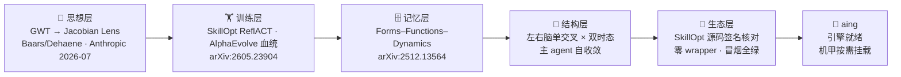

# aing · Knowledge Metabolism Engine

> Architecture for Intelligent Networked Growth
>
> 让知识库自己活着 —— 超越 RAG，超越 LLM Wiki，进入主动代谢时代。
>
> *aing is the engine: mature first, then mount into any chassis — the engine stays, the chassis is swappable.*
>
> aing 是引擎：先把自己磨成熟，机甲成熟哪家，就装进哪家——引擎不变，底盘随意。

**Let your knowledge base grow itself — beyond RAG, beyond LLM Wiki, into active metabolism.**

[](https://github.com/doerking/aing)
[](https://github.com/doerking/aing)

---

## 🔥 Shell-Agnostic · Verified

> aing binds to **no note-taking app**. Verified: **plain Markdown + Git + Node alone run the full metabolism loop.**
> Tolaria / Obsidian / SilverBullet / plain terminal — all are optional front-end shells. 有条件就把两脑实体软件（Tolaria + LLM Wiki）配置上，见下文「两脑实体软件」。

| Pillar | What it doesn't fuss over | Status |
|---|---|---|
| Shell-agnostic | Front-end / storage / runtime | ✅ |
| Consciousness Neural | Sensory → Guide Chain → Consciousness 3-layer | ✅ implemented |
| Metacognition | Self-check → Evaluate → Adjust 3-layer | ✅ implemented |
| Tri-Path Orchestrator | Explore / Verify / Optimize with circuit breaker | ✅ implemented (mock data) |

**Feed it a bowl of plain MD + any LLM + any collaborator, and it grows a complete metabolism.**

## 🫀 Two-Brain Bodies (Optional) / 两脑实体软件（可选）

> The release is the **plain-Markdown edition** — MD + Git + Node alone run the full metabolism loop. No extra software required.
> 有条件的用户，可以把两脑各自的实体软件挂上，让秩序脑与生长脑各得其所：

| Brain | Entity Software / 实体软件 | What it adds / 补上什么 |
|---|---|---|
| Order Brain / 秩序脑 | [Karpathy's LLM Wiki](https://karpathy.ai)（编译范式软件） | 摄入 → 编译 → 查询的成熟编译前端 |
| Growth Brain / 生长脑 | Tolaria（笔记外壳） | 人读视图、双向链接浏览、每日笔记 |

> 两者均为可选外壳：aing 不绑定任何一款 —— 卸掉任何一个，代谢照跑。
> Both are optional shells: aing binds to neither — unplug either one and the metabolism keeps running.
>
> 📦 实装建议（数据流契约、运行节律、验收清单）：**[Two-Brain Bodies Setup / 两脑实体实装建议](./docs/Engineering/TWO-BRAIN-BODIES.md)**

---

## One Line / 一句话

aing is not a fork or modification of [Karpathy's LLM Wiki](https://karpathy.ai) — it is an **upgrade from the "compilation paradigm" to the "metabolism paradigm."**

aing 不是对 LLM Wiki 模式的修改或分支，而是从"编译范式"到"代谢范式"的升级。

| | Karpathy LLM Wiki | aing |
|---|---|---|
| Paradigm | Compilation / 编译 | **Metabolism / 代谢** |
| Growth | Linear: ingest→compile→query | Non-linear: sprout·pollinate·metabolize·regenerate |
| LLM role | Single LLM as "programmer" | Order Brain (compile) + Growth Brain (metabolic) |
| Ceiling | ~200 sources / 50K tokens | Theoretically unbounded |

## Architecture / 架构

```
┌──────────────────────────────────────────────────────────────┐
│                    aing · 架构                                │
├──────────────────────────┬───────────────────────────────────┤
│   Order Brain / 秩序脑   │   Growth Brain / 生长脑            │
│   (compile.js)           │   (sprout/pollinate/compress/prune)│
│ • MD + Git               │ • Sprouting / Pollination           │
│ • entities/links Graph   │ • Mustard Seed / Tissue Culture    │
│ • Type Classification    │ • KESPI Metabolism                 │
│ • YAML frontmatter       │ • Expiry Decay                    │
├──────────────────────────┴───────────────────────────────────┤
│ Consciousness Neural / 意识神经                               │
│ • Sensory Endings (file polling)                             │
│ • Neural Guide Chain (attention scoring)                     │
│ • Consciousness Layer (briefing generation)                  │
├──────────────────────────────────────────────────────────────┤
│ Metacognition / 元认知                                        │
│ • Self-check → Evaluate → Adjust                             │
├──────────────────────────────────────────────────────────────┤
│ Tri-Path Orchestrator / 三路突击                               │
│ • Explore / Verify / Optimize + Circuit Breaker              │
├──────────────────────────────────────────────────────────────┤
│ Storage: fs-based (wiki/entities/*.md, wiki/links/*.md)      │
│          + sql.js (in-memory SQLite via knowledge-store.js)  │
│ Runtime: Node.js CommonJS (.js), no TypeScript, no build     │
└──────────────────────────────────────────────────────────────┘
```

---

## Quick Start / 快速开始

```bash
# 1. Clone
git clone https://github.com/doerking/aing.git
cd aing

# 2. Install dependencies（一条命令装齐：sql.js / transformers / sharp）
npm install

# 3. Configure
cp growth.config.example.ts growth.config.js
# edit growth.config.js → adjust KESPI thresholds and jiezi settings

# 4. Initialize database (pre-built knowledge.db included, or regenerate)
node src/setup-db.js                 # verify / create if missing
node src/setup-db.js --reset         # reset to empty (auto-backup)

# 5. Add your knowledge (put .md files in raw/)
echo "# My First Knowledge

Content here...

[tag:example]
" > raw/my-first-doc.md

# 6. Run full metabolism pipeline (compile → import → link → vector → kespi)
node src/run-metabolism.js

# 7. Smart mode (GrowthDirector decides what to do)
node src/run-metabolism.js --smart

# 8. With feedback analysis (before/after comparison)
node src/run-metabolism.js --smart --feedback

# 9. View KESPI 8-dim scores
node src/show-kespi.js

# 10. Scan knowledge gaps
node src/gap-detector.js

# 11. Growth director (decision only)
node src/growth-director.js

# 12. Guide chain swarm (multi-agent deliberation)
node src/guide-chain-swarm.js
```

> **Note**: aing is a collection of standalone Node.js scripts (CommonJS `.js`), not a TypeScript project — each script is run directly with `node`. `package.json` only declares dependencies & shortcuts (`npm run verify` / `npm run metabolism`).
>
> **Agent 必读：** 部署/验收/排障前先读 [`AGENTS.md`](./AGENTS.md)。部署完成后必跑 `node verify-deploy.js` —— 拿到 ALL GREEN 报告才算部署完成。

### Local Semantic Vectors (Optional) / 本地语义向量（可选）

> 发布包**已内置 384 维语义模型**（models\ 目录），装完依赖即是语义模式——本节仅在模型缺失/换机时需要。若只想用 64-dim 零依赖哈希向量，删除 `models\` 目录即可，全程约 10 分钟。

```bash
# 1. 一键安装（npm 依赖 + 模型下载，模型走 hf-mirror.com 国内镜像）
powershell -ExecutionPolicy Bypass -File setup-vectors.ps1

# 2. 重建索引为 384 维语义向量
node src/index-vectors.js --semantic --reindex
```

- 模型（all-MiniLM-L6-v2 量化版，约 22MB）落在 `models\` 目录，装完**纯离线**，零外呼。
- 国内网络**直连 huggingface.co 会超时**——脚本已默认走 hf-mirror 镜像，这是最常见的部署卡点，已替你排掉。
- 回退：删掉 `models\` 目录即回到纯哈希模式，两套向量在库里按维度自动区分、互不干扰。

---

## Database / 数据库

aing 使用 **sql.js**（SQLite WASM 纯 JS 版）作为结构化存储层，数据库文件位于 `knowledge.db`。

### 预置数据库

包内附带一个预初始化的空数据库 `knowledge.db`（表结构已建好，无数据），解压即用。

### 数据库管理

```bash
node src/setup-db.js              # 验证完整性 / 不存在则创建
node src/setup-db.js --reset      # 重置为空库（自动备份到 backups/）
node src/setup-db.js --verify     # 仅验证完整性
node src/setup-db.js --backup     # 手动备份
```

### 表结构

| 表名 | 用途 |
|------|------|
| `entities` | 知识实体（id, name, type, content, tags, confidence, source_file） |
| `links` | 实体间关联（source_id, target_id, relation, confidence） |
| `type_index` | 类型索引（加速按类型查询） |
| `entity_metadata` | 元数据 + KESPI 分数（originality, relevance, consistency, provability, utility, kespi_score） |
| `entity_embeddings` | 向量索引（embedding BLOB, dimension） |
| `error_log` | 错误日志（self-growth 错误处理） |
| `kespi_history` | KESPI 评分历史（8 维分数 JSON） |

### 备份与恢复

- 每次 `--reset` 自动备份到 `backups/knowledge-{timestamp}.db`
- 手动备份: `node src/setup-db.js --backup`
- 恢复: 将备份文件复制回 `knowledge.db`

### 注意事项

- 数据库为**单文件**（`knowledge.db`），可直接复制/移动
- 使用 sql.js（WASM），**无需编译** native 模块
- 数据全量加载到内存，写入时全量导出——适合中小规模知识库（<10MB）
- 大规模场景建议迁移到 better-sqlite3 或 PostgreSQL

---

## Scripts / 脚本一览

### 核心流水线

| 脚本 | 用途 | 输入 → 输出 |
|------|------|------------|
| `run-metabolism.js` | **全流程**（9 步）+ 智能模式 | raw/* → 完整代谢 |
| `compile.js` | 秩序脑编译 | raw/*.md → wiki/entities/*.md |
| `import-from-wiki.js` | 导入数据库 | wiki/ → SQLite |
| `auto-link.js` | 自动发现链接 | 实体标签/关键词 → links 表 |
| `index-vectors.js` | 向量索引（默认 64-dim 哈希，`--semantic` 升级 384 维语义） | 实体内容 → embedding |
| `sprout.js` | 发芽引擎 | 实体 → 新链接建议 |
| `pollinate.js` | 授粉引擎 | 跨域知识融合 |
| `compress.js` | 芥子压缩 | 低频 → 芥子库 |
| `kespi-check.js` | KESPI 八维评估 | 实体 → 8 维分数 |
| `prune.js` | 剪枝清理 | 过期知识归档 |

### 决策层（新增）

| 脚本 | 用途 | 输入 → 输出 |
|------|------|------------|
| `growth-director.js` | 生长决策器（前额叶决策） | 感知信号 → 9种动作之一 |
| `guide-chain-swarm.js` | 导链蜂群（多Agent决策） | 紧急度 → 多Agent投票 |
| `gap-detector.js` | 缺口检测器（5维扫描） | 数据库 → 缺口报告 |
| `feedback-loop.js` | 闭环反馈（效果感知+调优） | 前后快照 → 调优建议 |

### 辅助工具

| 脚本 | 用途 | 输入 → 输出 |
|------|------|------------|
| `show-kespi.js` | 显示 KESPI 分数 | 数据库 → 报告 |
| `recalc-kespi.js` | 批量重算 KESPI | 修复后历史数据修正 |
| `setup-db.js` | 数据库管理 | 创建/重置/验证/备份 |

### 意识神经

| 脚本 | 用途 | 输入 → 输出 |
|------|------|------------|
| `neural-architecture.js` | 意识神经 3 层 | 感知→导链→意识 |
| `tri-path-orchestrator.js` | 三路突击 | 探索/验证/优化 |
| `metacognition-layer.js` | 元认知 | 自检→评估→调参 |
| `consciousness-layer.js` | 意识层 | 状态监控/告警 |
| `neural-guide-chain.js` | 神经导链 | 信号路由 |

---

## Documentation / 文档

### 📖 User Guide（普通用户）
- [知识库怎么自己收拾烂摊子](./docs/User-Guide/01-Tolaria-How-It-Works.md)
- [KESPI 体检分数是怎么管系统的](./docs/User-Guide/02-KESPI-Threshold-Guide.md)
- [常见问题 FAQ](./docs/User-Guide/03-FAQ.md)
- [知识库会自己感知、思考、汇报](./docs/User-Guide/04-Consciousness-Neural.md)
- **English / 英文：** [`docs/User-Guide/en/`](./docs/User-Guide/en/)

### 🔧 Engineering（开发者 / 复刻者）
- [Architecture / 架构](./docs/Engineering/ARCHITECTURE.md)
- [Data Model / 数据模型](./docs/Engineering/DATA-MODEL.md)
- [Interfaces / 接口](./docs/Engineering/INTERFACES.md)
- [Config Reference / 配置](./docs/Engineering/CONFIG-REFERENCE.md)
- [Metabolism Pipeline / 代谢流水线](./docs/Engineering/METABOLISM-PIPELINE.md)
- [Shell-Agnostic Integration / 集成](./docs/Engineering/TOLARIA-INTEGRATION.md)
- [Two-Brain Bodies Setup / 两脑实体实装建议](./docs/Engineering/TWO-BRAIN-BODIES.md)
- [Conflict Resolution / 冲突仲裁](./docs/Engineering/CONFLICT-RESOLUTION.md)
- [ADR-001](./docs/Engineering/ADR-001-compilation-to-metabolism.md)
- [ADR-002](./docs/Engineering/ADR-002-single-sqlite.md)
- [Verified Modules / 已验证模块](./docs/Engineering/VERIFIED-MODULES.md)
- [Consciousness Neural / 意识神经架构](./docs/Engineering/CONSCIOUSNESS-NEURAL-ARCHITECTURE.md)
- [Ecosystem Status Report / 生态状态报告](./docs/Engineering/ECOSYSTEM-STATUS-REPORT.md)
- [Auto-Ingest / 会话自动入库](./docs/Engineering/AUTO-INGEST.md)
- **English / 英文：** [`docs/Engineering/en/`](./docs/Engineering/en/)

---

## Roadmap

- [x] Phase 0 — Order Brain (compile.js: raw→wiki, fs-based, Git commit)
- [x] Phase 1 — Growth Brain v1 (sprouting, pollination, mustard seed, pruning)
- [x] Phase 2 — KESPI self-check (8-dim weighted scoring, 3-color light, DB-backed via kespi_history)
- [x] Phase 2.5 — Consciousness Neural Architecture (sensory + guide chain + consciousness)
- [x] Phase 2.6 — Metacognition Layer (self-check + evaluate + adjust)
- [x] Phase 2.7 — Tri-Path Orchestrator (explore/verify/optimize + circuit breaker)
- [ ] Phase 3 — Full metabolism automation (scheduler, hot-reload)
- [ ] Phase 4 — Productionization (API server, multi-tenant)

## Vision & Operations / 愿景与运行

> 想知道 aing 的愿景如何实现、部署后如何跑代谢、训练与真执行器怎么接入？读这一篇：
> **[愿景与运行手册 · Vision & Operations Playbook](./raw/vision-and-operations.md)**（中英双语 · bilingual）

## 🧬 Architecture Lineage / 架构谱系与验证锚点

> Every anchor below is clickable and independently verifiable. 本表每一格都可点击核查，欢迎逐格翻验。



| 层 | 锚点 | 出处 | 状态 |
|---|---|---|---|
| 🧠 思想层 | GWT → Jacobian Lens (2026-07) | [Baars/Dehaene](https://www.transformer-circuits.pub/) · Anthropic 实证 | 已对齐 |
| 🏋️ 训练层 | SkillOpt 六阶段 (ReflACT) + AlphaEvolve 血统 | [MSR SkillOpt (arXiv:2605.23904)](https://arxiv.org/abs/2605.23904) · [OpenEvolve](https://github.com/codelion/openevolve) | adapter 就位 |
| 🗄️ 记忆层 | Forms–Functions–Dynamics 三维框架 | [arXiv:2512.13564](https://arxiv.org/abs/2512.13564) · [Agent-Memory-Paper-List](https://github.com/Shichun-Liu/Agent-Memory-Paper-List) | 双脑落地 / 双时态迭代 |
| 🧬 结构层 | 左右脑单交叉 × 双时态 | 主 agent 自收敛，非编排手写 | 迭代中 |
| 🔌 生态层 | SkillOpt 源码签名核对（零 wrapper） | [MSR SkillOpt](https://microsoft.github.io/SkillOpt/) | EnvAdapter 就位，冒烟全绿 |

## 🙏 Acknowledgments / 致谢

aing 站在这些肩膀上（按三层闭环归位，排名不分先后）：

### 思想源头 / Intellectual Origins

- **认知科学的思想源头** — Baars / Dehaene 的全局工作空间理论（意识层的 GWT 映射）、赫布可塑性（生长与剪枝的学习律）、Richard Sutton 的 "Era of Experience"（经验时代的自进化方向）。aing 的意识神经蓝图从中取火。
- **[Anthropic · Jacobian Lens](https://www.transformer-circuits.pub/)** — 《Verbalizable Representations Form a Global Workspace in Language Models》（2026-07）在 LLM 内部首次实证全局工作空间：可读出、可干预、容量极小、只服务灵活推理。aing 的 GWT 映射自此从理论隐喻升级为工程对标。

### 进化环 / Evolution Loop · Training & Implementation

- **[Microsoft SkillOpt](https://github.com/microsoft/SkillOpt)**（arXiv:2605.23904，MSR 与上海交大等）— “技能文档即可训练参数”的思想与六阶段训练循环（ReflACT：Rollout→Reflect→Aggregate→Select→Update→Validate）。aing 的进化环（`training/adapter.py`）基于其 EnvAdapter 接口构建；其 SkillOpt-Sleep（夜间回放失败任务写入技能文档）与 aing 的代谢回炉互为同构印证。
- **[DeepMind AlphaEvolve 及开源生态](https://github.com/topics/alpha-evolve)**（OpenEvolve / CodeEvolve / GigaEvo）— LLM×进化算法的程序空间优化，双向血统追踪让每个后代可溯源，与 aing 回炉微粒沿 `recycled_from` 血统链可溯源的 KPI 殊途同归。
- **OPT 实现历程** — aing 的训练副本与实现现场。影子目录隔离、EnvAdapter 按源码签名逐条核对、32 条取自部署包真实口径的矛盾任务包、KESPI 斜率天然挂钩训练奖励，三项核心组件一次冒烟即“已就位”。aing 不需要为被训练而改造自己：它活着的方式就是被训练的方式。

### 数据层 / Data Layer · The Dual-Brain Foundation

- **[sql.js](https://github.com/sql-js/sql.js)** 与 **Node.js**（内置 `node:sqlite`）— 双脑数据层的零原生编译底座。
- **[@xenova/transformers](https://github.com/xenova/transformers.js)** 与 **[all-MiniLM-L6-v2](https://huggingface.co/Xenova/all-MiniLM-L6-v2)** — 纯本地、零外呼的语义向量能力（384 维混合检索）。
- **[Memory in the Age of AI Agents: A Survey](https://arxiv.org/abs/2512.13564v1)**（Hu et al., 2025，arXiv:2512.13564，NUS、人大、复旦、北大等 12 家机构；官方配套论文列表与资源索引：[Agent-Memory-Paper-List](https://github.com/Shichun-Liu/Agent-Memory-Paper-List)）— “形式-功能-动态”三维正交框架及其“事实记忆与经验记忆必须严格分离”的论断，为双脑数据层提供行业话语体系；Zep Graphiti 的双时态知识图是记忆时间维度的现成参照。

### 运行后端 / Runtime Backend

- **[DeepSeek](https://www.deepseek.com/)** — M2 影子训练联调的 LLM 后端（openai_compatible 模式）。

> 灵感属于所有人，实现属于此刻。
> *If I have seen further, it is by standing on the shoulders of giants.*

## License
MIT — see [LICENSE](./LICENSE) for the full license text.

Third-party components and their licenses are documented in [THIRD-PARTY-NOTICES.md](./THIRD-PARTY-NOTICES.md).
