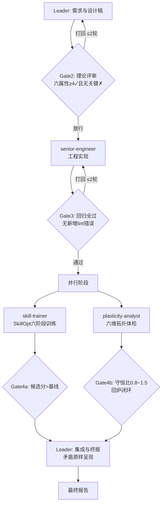

# Workflow — 神经进化团队

## Overview



门禁哲学：每个 Gate 的拒绝都是信息而非惩罚——打回时必须携带结构化的缺口/失败现场，让上游知道改什么。

## Detailed Steps

1. **需求与设计稿**（Leader，串行）
   - 输入：用户诉求 + aing 模块地图 + v2 路线（consciousness-neural-methodology 技能）
   - 动作：产出设计稿（目标/模块边界/数据流/阈值/验收标准）
   - 输出：设计稿文档
   - 质量门槛：数据流必须画清信号源与消费者；阈值必须查公式上限

2. **理论评审**（neuro-theorist，串行，对抗门禁）
   - 输入：设计稿 + 仓库路径（取证用）
   - 动作：六属性打分 + 四支柱映射 + 缺口清单
   - 质量门槛（Gate2）：✓ ≥ 4 项且无关键 ✗ 才放行；打回必须附完整缺口清单

3. **工程实现**（senior-engineer，串行）
   - 输入：过审设计稿 + 仓库路径
   - 动作：最小可验证改动，逐改动验证
   - 质量门槛（Gate3）：回归全过且无新增 lint 错误；失败附现场打回

4. **训练与体检**（skill-trainer ∥ plasticity-analyst，并行）
   - trainer：加载仲裁任务包 → SkillOpt 六阶段循环 → 产出 best_skill 候选（影子模式标注）
     - 质量门槛（Gate4a）：候选分严格大于当前基线；未过=影子留档不应用
   - analyst：六维拓扑体检 → 健康报告 + 处方
     - 质量门槛（Gate4b）：守恒比 0.8~1.5 且回炉闭环成立；否则处方转 senior-engineer 工单

5. **集成与终报**（Leader，串行）
   - 动作：汇总四方输出，矛盾原样呈现不调解；trainer 未过 Gate 的候选标记为影子产物留档
   - 输出：最终报告

### 最终报告格式

```markdown
# 神经进化团队 — 运行报告

## 设计与理论裁决
[设计稿要点] + [六属性打分表] + [Gate2 裁决]

## 工程交付
[变更清单] + [回归证据] + [Gate3 裁决]

## 训练闭环
[训练历史] + [best_skill 候选与模式] + [Gate4a 裁决]

## 拓扑健康
[六维体检] + [综合诊断] + [处方] + [Gate4b 裁决]

## 遗留矛盾与影子产物
[未调解的分歧，原样呈现] + [影子模式留档清单]
```

## Acceptance Criteria

- 四个角色各产出一份符合其 Output Schema 的报告
- 全部 Gate 有明确裁决记录（放行/打回轮次/理由）
- 影子模式与正式模式的产物边界清晰，无越界应用
- 最终报告完整、矛盾未被静默调解
- 若发生降级运行（角色缺失），报告中显式标注降级范围
